# Kilosort4: Introduction, Architecture & Citations

---

## 1. Overview & Scientific Motivation

**Kilosort4** is an automated, GPU-accelerated spike sorting framework designed to resolve single-unit action potentials from high-density extracellular electrophysiology probes (e.g., Neuropixels 1.0/2.0, silicon polytrodes, and microelectrode arrays).

Traditional spike sorters process data sequentially through independent heuristic stages: bandpass filtering, amplitude thresholding, feature extraction (PCA), and clustering. This decoupled approach suffers from the **"spike collision problem"**: when multiple neurons fire within a shared 1–2 ms window, their overlapping extracellular electrical fields distort features and escape classical clustering algorithms.

Kilosort4 overcomes these challenges through:
1. **Iterative Convolutional Matching Pursuit (Deconvolution)**: Learns spatio-temporal templates directly from the recording and iteratively subtracts ("peels") detected waveforms from the raw signal, resolving overlapping spikes.
2. **Graph-Based Clustering**: Replaces the recursive bimodality pursuit and scaled $k$-means of Kilosort1–3 with modern graph clustering (subsampled nearest neighbors via `faiss`, neighbor reassignment, and hierarchical linkage trees).
3. **Pretrained Universal Detection & Basis Weights**: Uses a compact bank of 6 universal waveform templates (`wTEMP.npy`) for initial candidate detection across arbitrary probe geometries, alongside a 6-component orthonormal temporal basis (`wPCA.npy`) for feature dimensionality reduction.
4. **Non-Rigid Spatial Drift Correction**: Models electrode displacement over time (tissue settling, brain pulsation) across distinct depth bins without requiring hardware tracking.

---

## 2. Core Algorithmic Principles

```mermaid
flowchart LR
    A["Raw Voltage\n[Channels, Samples]"] --> B["Median CAR\n(do_CAR=True)"]
    B --> C["Bandpass Filter\n(300 Hz High-Pass)"]
    C --> D["Local ZCA Whitening\n(32-NN Neighborhoods)"]
    D --> E["Universal Matching\n(wTEMP Convolutions)"]
    E --> F["Spatial Dedup\n(35 µm Radius)"]
    F --> G["Graph Clustering\n(faiss k-NN Tree)"]
    G --> H["Learned Templates\n& Deconvolution"]
    H --> I["Phy / NWB Units\nExport"]
```



* **Zero-Phase Common Average Reference (CAR)**: Removes widespread non-biological noise and stimulation artifacts prior to temporal filtering.
* **Local ZCA Spatial Whitening**: Equalizes background variance and suppresses distant neural crosstalk ($100\text{--}1000\,\mu\text{m}$) by whitening each electrode against its 32 nearest spatial neighbors.
* **Candidate Extraction**: Convolves multi-channel traces with L2-normalized universal templates (`wTEMP`) centered at the primary trough offset to isolate localized energy peaks.
* **Community Reassignment**: Clusters spikes into individual neural units in local spatial feature spaces, producing learned multi-channel templates.

---

## 3. Official References & Academic Citations

### Primary Journal Publication
* **Title**: *Spike sorting with Kilosort4*
* **Authors**: Marius Pachitariu, Shashwat Sridhar, Jacob Pennington, Carsen Stringer
* **Journal**: *Nature Methods*, Vol. 21, Issue 5, pp. 914–921 (2024)
* **DOI**: [10.1038/s41592-024-02232-7](https://doi.org/10.1038/s41592-024-02232-7)

### Preprint Reference
* **Title**: *Solving the spike sorting problem with Kilosort*
* **Server**: *bioRxiv* (2023)
* **DOI**: [10.1101/2023.01.07.523036](https://doi.org/10.1101/2023.01.07.523036)

### Official Links & Code Repositories
* **Official GitHub**: [https://github.com/MouseLand/Kilosort](https://github.com/MouseLand/Kilosort)
* **Official Documentation**: [https://kilosort.readthedocs.io](https://kilosort.readthedocs.io)

### BibTeX Entry
```bibtex
@article{pachitariu2024kilosort4,
  title     = {Spike sorting with {Kilosort4}},
  author    = {Pachitariu, Marius and Sridhar, Shashwat and Pennington, Jacob and Stringer, Carsen},
  journal   = {Nature Methods},
  volume    = {21},
  number    = {5},
  pages     = {914--921},
  year      = {2024},
  publisher = {Nature Publishing Group},
  doi       = {10.1038/s41592-024-02232-7},
  url       = {https://doi.org/10.1038/s41592-024-02232-7}
}
```
